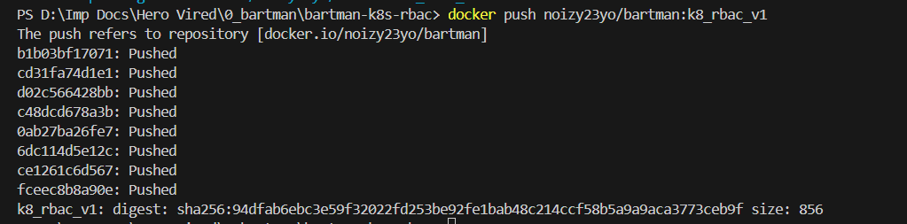
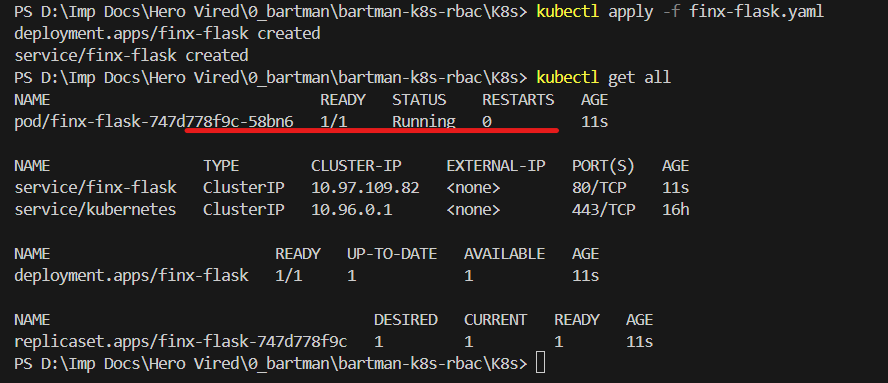
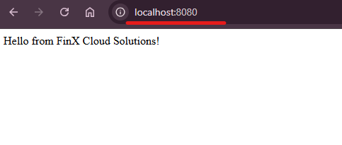
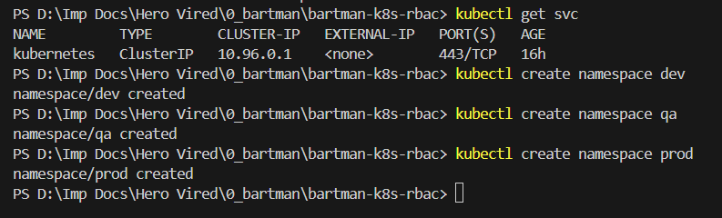
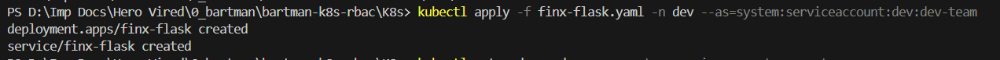
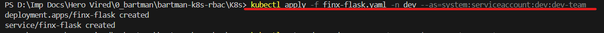
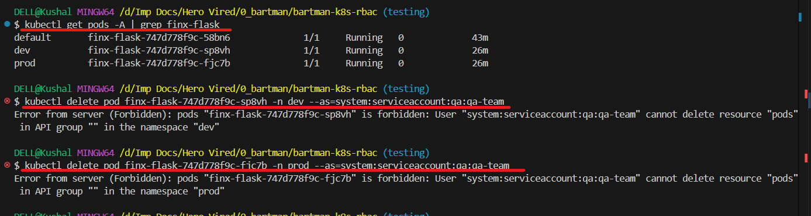

# Kubernetes RBAC for Starters

- Author: U Kushal Rao  
- Project: Kubernetes RBAC for Starters

## Overview

This repository demonstrates a simple Flask application containerized with Docker, deployed to Kubernetes using a `ClusterIP` Service, and tested via port-forwarding.  
The focus of this project is implementing **Role-Based Access Control (RBAC)** for different teams (**Dev**, **QA**, **Prod**) using ServiceAccounts and RBAC policies, and verifying access through impersonation commands.  

## Repository layout

```
│   .gitignore
│   app.py
│   Dockerfile
│   README.md
│   
├───K8s
│   └─── finx-flask.yaml
│       
├───RBAC
    └─── dev-role.yaml
         prod-role.yaml
         qa-clusterroles.yaml
```
## Build and Push Docker Image

The Flask app was containerized and pushed to Docker Hub:

```bash
docker build -t noizy23yo/bartman:k8_rbac_v1 .
docker push noizy23yo/bartman:k8_rbac_v1
```
- *Screenshot:*

<p align="center">  </p> 

<br>

## Kubernetes Deployment

Applied the manifest to deploy the Flask app with a `ClusterIP` service:

```
kubectl apply -f K8s/finx-flask.yaml
kubectl get all

```
- *Screenshot:*

<p align="center">  </p> 

<br>

Since it uses `ClusterIP`, accessed the app using port-forwarding:
```
kubectl port-forward svc/finx-flask 8080:80
```
Open `http://localhost:8080` to verify.
- *Screenshot:*

<p align="center">  

<br>

## RBAC Implementation
### Namespace Creation

Created separate namespaces for `Dev`, `QA`, and `Prod`:
```
kubectl create namespace dev
kubectl create namespace qa
kubectl create namespace prod
kubectl get namespaces
```
- *Screenshot:*

<p align="center">  </p> 

<br>

### ServiceAccounts and Roles
- Created ServiceAccounts for each team (`dev-team`, `qa-team`, `prod-team`).
- Applied RBAC roles from the `RBAC/` folder to restrict actions.


## Testing RBAC Access
### ✅ Dev Team

Deploy Flask app in `dev` namespace (allowed):
```
kubectl apply -f K8s/finx-flask.yaml -n dev --as=system:serviceaccount:dev:dev-team
```
- *Screenshot:*

<p align="center">  </p>

<br>

Check pods in dev (allowed):
```
kubectl get pods -n dev --as=system:serviceaccount:dev:dev-team
```
- *Screenshot:*

<p align="center">  </p>

<br>

Try deploying in `prod` (forbidden):
```
kubectl apply -f K8s/finx-flask.yaml -n prod --as=system:serviceaccount:dev:dev-team
```
- *Screenshot:*

<p align="center">  </p>

<br>

### ✅ QA Team

QA can view resources across namespaces:
```
kubectl get pods -n dev --as=system:serviceaccount:qa:qa-team
kubectl get pods -n qa --as=system:serviceaccount:qa:qa-team
kubectl get pods -n prod --as=system:serviceaccount:qa:qa-team
```
But deleting pods is forbidden:
```
kubectl delete pod <pod-name> -n dev --as=system:serviceaccount:qa:qa-team
kubectl delete pod <pod-name> -n prod --as=system:serviceaccount:qa:qa-team
```
- *Screenshot:*

<p align="center">  </p>

<br>

### ✅ Prod Team

Deploy Flask app in prod namespace (allowed):
```
kubectl apply -f K8s/finx-flask.yaml -n prod --as=system:serviceaccount:prod:prod-team
```
- *Screenshot:*

<p align="center">  </p> </p>

<br>


## Conclusion

- **Dev team**: Limited to creating resources in the `dev` namespace only.

- **QA team**: Read-only access across all namespaces. Forbidden from modify/delete.

- **Prod team**: Allowed to deploy in the `prod` namespace only.

- **RBAC policies** were validated by impersonating service accounts and capturing errors.

This project demonstrates **Kubernetes RBAC fundamentals** with clear segregation of responsibilities between Dev, QA, and Prod teams.


